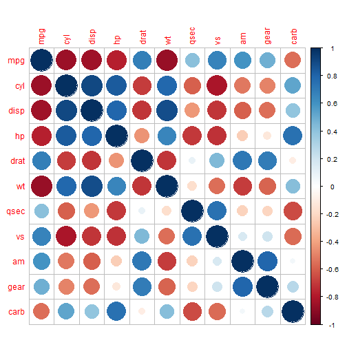

Data Products App Pitch
========================================================
author: Akshat Narain
date: Sun Jan 25 03:57:56 2015

About The Application
========================================================

The application help you predict the efficiency of your automobile by using four basic predictors:

- Transmission type of the automobile (automatic vs. manual)
- Weight of the automobile (in pounds) (1000 - 5000)
- Number of carburetors in the automobile (1 - 8)
- Engine type (V vs S)

Efficiency is measured in miles per gallon of the automobile.

Prediction Dataset
========================================================

The prediction algorithm is based on the **mtcars** dataset in R datasets. The data is extracted from the 1974 Motor Trend US Magazine and comprises fuel consumption and 10 aspects of automobile design and performance for 32 automobiles (1973 to 1974 models). The extract below shows dataset with four predictors.


```
                  am    wt carb vs
Mazda RX4          1 2.620    4  0
Mazda RX4 Wag      1 2.875    4  0
Datsun 710         1 2.320    1  1
Hornet 4 Drive     0 3.215    1  1
Hornet Sportabout  0 3.440    2  0
Valiant            0 3.460    1  1
```

Exploratory Correlation Matrix
========================================================
 

p-values suggest second model gives best prediction
========================================================


```
Analysis of Variance Table

Model 1: mpg ~ am
Model 2: mpg ~ am + wt + carb + vs
Model 3: mpg ~ am + wt + carb + vs + qsec + hp + cyl + disp + drat + gear
  Res.Df    RSS Df Sum of Sq       F    Pr(>F)    
1     30 720.90                                   
2     27 183.48  3    537.42 25.5057 3.377e-07 ***
3     21 147.49  6     35.98  0.8538    0.5438    
---
Signif. codes:  0 '***' 0.001 '**' 0.01 '*' 0.05 '.' 0.1 ' ' 1
```


